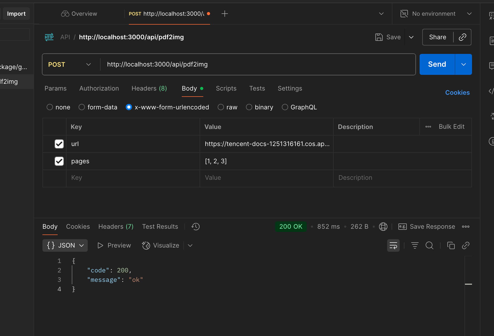

# PDF to Image Converter

A simple tool to convert PDF files to images.

## Prerequisites
- Node.js 20+
- Docker (optional)

## Installation
```bash
npm install
```

## Running the App

### Without Docker
```bash
npm start
```

### With Docker
1. Build the Docker image:
```bash
docker build -t pdf2img .
```
2. Run the container:
```bash
docker run -p 3000:3000 pdf2img
```

### Using PM2 for Monitoring
```bash
npm install pm2 -g
npm run pm2
```

# 特性

* 支持数据分片，拆4个子片，并发请求

# TODO

1、pkg

2、pm2 部署


# 请求示例：

## 不带页码默认首页


## 带页码多页
