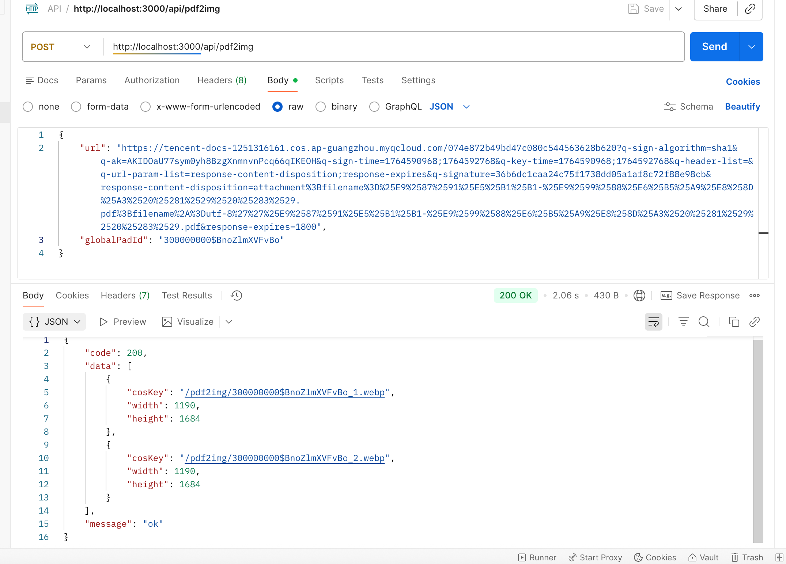

# PDF 生图服务

## Prerequisites
- Node.js 20+
- Docker (optional)

## Installation
```bash
pnpm i
```

## Running the App

### Without Docker
```bash
npm start
```

### Using PM2 for Monitoring
```bash
npm install pm2 -g
npm run pm2
```

# 特性

* 支持数据分片，拆4个子片，并发请求
* 接入cos桶

# 本地测试

## 测试接口说明
项目提供了 `/test-local` 接口用于本地开发测试，**该接口仅在开发环境可用，不会打包到生产环境**。

### 使用方法
1. 设置环境变量：
```bash
export NODE_ENV=dev
```

2. 启动服务：
```bash
npm start
```

3. 访问测试接口：
```bash
curl http://localhost:3000/test-local
```

### 注意事项
- 测试接口会自动使用 `static/1M.pdf` 作为测试文件
- 截图输出目录默认为 `output/`，可通过环境变量 `OUTPUT_DIR` 自定义
- **生产环境部署时，`src/test-local-route.js` 不会被打包（已在 `.dockerignore` 中排除）**

# TODO

1、pkg

2、pm2 部署


# 请求示例：




# docker 镜像(devcloud)

## 自动打镜像脚本
```
npm run docker:push
```

## 镜像发布前需要确认的事情(TODO: 自动化脚本)

1、✅单测全部通过

2、✅镜像验证


## mirrors.tencent.com
[仓库地址](https://mirrors.tencent.com/#/private/docker/detail?project_name=tdocs-pdf&repo_name=pdf2img)

```
1、打镜像
docker build -t pdf2img:v1.0.0 ./ 

2、查看镜像
docker images 

3、打tag
docker tag 486ff26017ff mirrors.tencent.com/tdocs-pdf/pdf2img:v2

4、推送
docker push mirrors.tencent.com/tdocs-pdf/pdf2img:v2

5、登陆
docker login --username johnsomwu --password [token] mirrors.tencent.com
```

## csighub.tencentyun.com
[仓库地址](https://csighub.woa.com/tencenthub/repo/detail/pdf-developer/pdf2img/images)
```
0、登陆
sudo docker login csighub.tencentyun.com

1、打镜像
sudo docker build -t pdf2img:[tag] ./

2、查看镜像[imageid], 关联下面的 tag
sudo docker images

3、打tag
sudo docker tag [imageid] csighub.tencentyun.com/pdf-developer/pdf2img:[tag]

4、push
sudo docker push csighub.tencentyun.com/pdf-developer/pdf2img:[tag]
```

# 镜像调试

```
// 运行
sudo docker run -d --name my-container -p 3000:3000 pdf2img:202508272112
// 停止
sudo docker stop my-container
// 移除
sudo docker remove my-container
// 查看docker内存占用
sudo docker stats my-container
// 查看docker日志
sudo docker logs my-container
// 查看运行在容器内的日记
sudo docker exec -it my-container /bin/sh
cd pm2/logs
```

# 压测
```bash
autocannon "http://localhost:3000/api/pdf2img" \
  -m POST \                              # 指定 POST 方法
  -H "Content-Type: application/json" \  # 设置 JSON 请求头
  -b '{"url":"https://example.com/doc.pdf", "globalPadId":"12345"}' \  # 必需参数
  -c 50 \                                # 50 个并发连接
  -p 5 \                                 # 每个连接管道化 5 个请求（提升吞吐）
  -d 30 \                                # 持续测试 30 秒
  -l \                                   # 输出完整延迟分布
  -t 20                                  # 超时20s
  -j > report.json                       # 生成 JSON 格式报告

// demo
autocannon "http://localhost:3000/api/pdf2img" -m POST -H "Content-Type: application/json" -b '{"url":"https://tencent-docs-1251316161.cos.ap-guangzhou.myqcloud.com/fcf2e1c0bb8749b98d3b7cc39a3de266?q-sign-algorithm=sha1&q-ak=AKIDOaU77sym0yh8BzgXnmnvnPcq66qIKEOH&q-sign-time=1756348774;1756350574&q-key-time=1756348774;1756350574&q-header-list=&q-url-param-list=response-content-disposition;response-expires&q-signature=01ad2adea3816a629203c01c982577108bca420d&response-content-disposition=attachment%3Bfilename%3D%25E9%2587%2591%25E5%25B1%25B1-%25E9%2599%2588%25E6%25B5%25A9%25E8%258D%25A3%2520%25281%2529%2520%25283%2529.pdf%3Bfilename%2A%3Dutf-8%27%27%25E9%2587%2591%25E5%25B1%25B1-%25E9%2599%2588%25E6%25B5%25A9%25E8%258D%25A3%2520%25281%2529%2520%25283%2529.pdf&response-expires=1800", "globalPadId":"300000000$BMhIpcSEKpOt"}' -t 20 -c 5 -p 5 -d 30 -l -j > report.json                       
```
